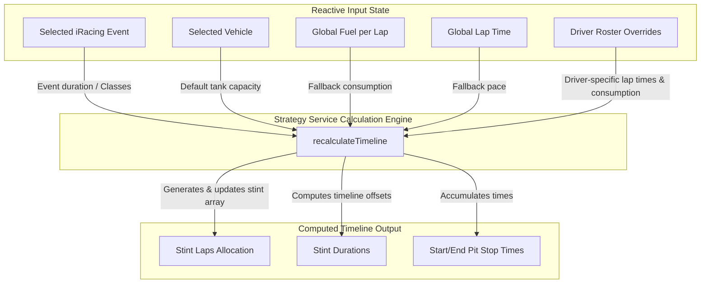

# RaceStrategist

WORK IN PROGRESS
RaceStrategist is a premium, high-performance web application designed for endurance racing teams to plan, calculate, and optimize stint strategies on the iRacing platform. Built using **Angular 20**, **Angular Signals**, and **Angular Material CDK**, the application provides real-time stint calculation, team driver management, and an interactive stint timeline.

---

## Design Philosophy & Aesthetics

RaceStrategist features a custom-built, immersive **"Midnight Track"** design system optimized for low-light endurance racing conditions:
- **Premium Glassmorphism**: Translucent cards utilizing modern CSS backdrop filters (`blur(12px)`) with subtle white borders.
- **Dynamic Micro-Animations**: Smooth entry animations (`fadeInUp`) and ripple effects to enhance interactive elements.
- **Harmonious Palette**: Focused on dark, saturated blues/blacks paired with high-contrast racing accent colors (e.g., **Racing Amber** `#FFB000` and **Track Green** `#00E676`).
- **Modern Typography**: Bold display headings using the **Michroma** font combined with highly legible body text using **Outfit**.

- 


---

## Core Features

### 1. Static Strategy Calculator
- **Event & Vehicle Catalogs**: Select preset iRacing endurance events (such as *Daytona 24h*, *Sebring 12h*, or *Nürburgring 24h*) and vehicles. The application automatically filters vehicles matching the allowed class specifications (GT3, GTP, LMP2, etc.).
- 
- 
- **Dynamic Predictions**: Instantly computes maximum laps per stint, estimated stint durations, and total stints required based on fuel consumption rate and average lap times.

- **Tank Capacity Override**: Allows quick strategy adjustment by overriding vehicle-default fuel tank capacities.

### 2. Team & Driver Roster Management
- **Centralized Roster**: Manage driver list independently of active strategies.
- 
- **Detailed Profiles**: Save profile metrics including name, nationality, license grade, iRating, role (Primary/Reserve/Coach), and custom signature colors.
- 

- **Driver-Specific Overrides**: Input custom average lap times and fuel consumption rates per driver. If left empty, the application falls back to global strategy averages.
- **Roster Statistics**: Automatically tracks team performance, including average iRating computations.

### 3. Dynamic Stint Planner (Timeline)
- **Timeline Recalculation**: A ripple-effect calculation engine adjusts the entire race timeline whenever driver assignments, tyre-change toggles, or pit-lane delays are modified.
- **Tyre & Refueling Customization**: Toggle tyre changes per stint and inject extra pit lane offsets (e.g., penalties or extra service times) on the fly.
- **Drag-and-Drop Reordering**: Rearrange stint orders instantly with smooth, integrated drag-and-drop lists powered by `@angular/cdk/drag-drop`.

### 4. Interactive Library & Localization
- **Strategy Library**: Save configurations, load historical strategy setups, and clear state parameters inside a local database backed by browser `localStorage`.
- **Bilingual Interface**: Full translation mapping between **English (EN)** and **Spanish (ES)**.
- **State Navigation Protection**: Route guards (`unsavedChangesGuard`) check for unsaved modifications and prompt users prior to leaving active workspace configurations.

---

## System Architecture & Data Flow

The application utilizes Angular's reactive Signals paradigm to cascade inputs into real-time calculations. Changing any value in the roster or calculator immediately ripples updates down the timeline:



---

## Repository Structure

The code is cleanly modularized into Core and Feature modules:

```text
src/
├── app/
│   ├── app.config.ts        # Global configuration (routing, providers)
│   ├── app.routes.ts        # Protected application routing rules
│   ├── app.ts               # Core app layout / Shell component
│   ├── app.css              # Base styling variables and layouts
│   ├── core/
│   │   ├── guards/          # Router guard definitions (Auth, Unsaved Changes)
│   │   ├── models/          # Strongly-typed Interfaces & Enums (RaceStrategy, DriverProfile)
│   │   └── services/        # Strategy Engine, Catalog, Auth, Team, & Localization Services
│   └── features/
│       ├── home/            # Dashboard landing, telemetry alerts & team log events
│       ├── login/           # User authentication screen
│       ├── strategies-list/ # Strategy library overview and search
│       ├── strategy-calculator/ # Core dynamic stint planner and static calculator
│       └── team/            # Team settings and Driver roster editor
└── styles.css               # "Midnight Track" design system theme tokens and utilities
```

---

## Development & Running Locally

### Prerequisites
Make sure you have [Node.js](https://nodejs.org/) and the [Angular CLI](https://github.com/angular/angular-cli) installed.

### Installation
Clone the repository and install all dependencies:
```bash
npm install
```

### Run Development Server
To launch the server locally on `http://localhost:4200/`:
```bash
npm run start
# or
ng serve
```

### Production Build
To build the application for deployment:
```bash
npm run build
# or
ng build
```
Production assets will be output to the `dist/` directory.

### Testing
Execute unit tests via Karma runner:
```bash
npm run test
# or
ng test
```
